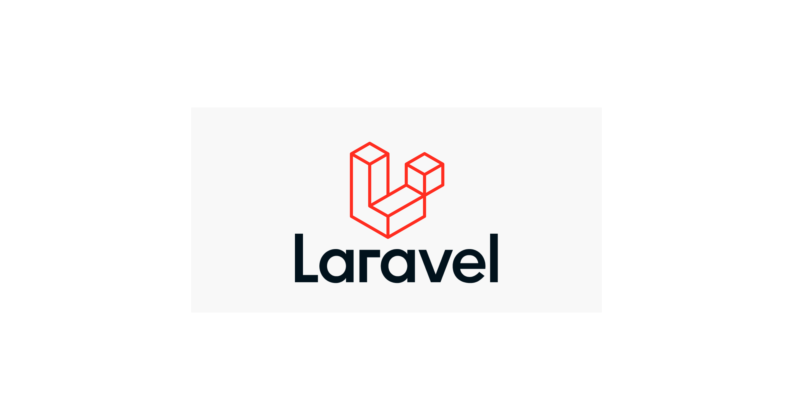

# E-commerce empresa X

 vamos  criar um **e-commerce**, para a *empresa x* e blablabla

 ## Funcionalidade:

 **checkout, _Tela de produto_, Catalago, home com banner**

 ###### Melhoria do projeto:

 __Melhoria 1__, _melhoria 2_

### linguagens do projeto:

* html
* CSS
* JavaScript
* PHP 
* MySQL

### Funcionalidades a desenvolver:

1. Area de membros
    1. Login diferente para grupor de cliente
    2. Desconto especial para grupos de clientes 
    3. CSS diferentes para grupos d e clientes
2. Integracao com outros pagamentos
3. Sistema de bonus primeira compra

#### Imagem local

#### Imagem externa

